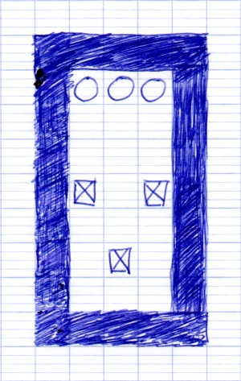
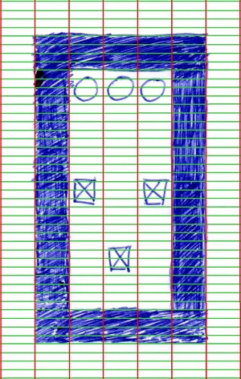
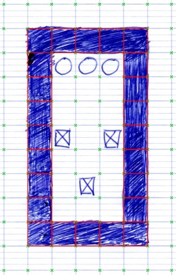
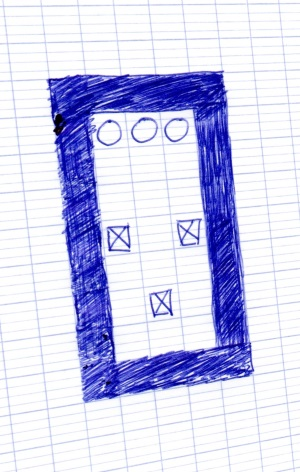

# Image processing

As a follow-up to last month's Sokoban game, a fun idea would be to try to generate Sokoban levels from hand-drawn images.

## The big picture

We would need to process input messages in order to

* detect lines and boundaries
* split the input image into tiles
* identify each kind of tile (see you next time!)

So if I give you the following input:

The goal is to detect lines and intersections in the image:

And then be able to determine the tiles boundaries:

## Useful tools

Actually drawing lines on an image can be done using the standard .Net System.Drawing namespace.

However, knowing which pixels are going to be part of a line, given its start and end coordinates, is already an exercise. One technique to do so is called a Bresenham line, and we can try to implement it in F#.

## Real-world

For this image processing pipe to be really usable, we would probably need to add a step at the beginning of this pipe, in order to detect the level boundaries in an image and have it projected back in an orthogonal plane.

i.e. transform this

into this

In order to do this, you might need external libraries... or write your own code :)
