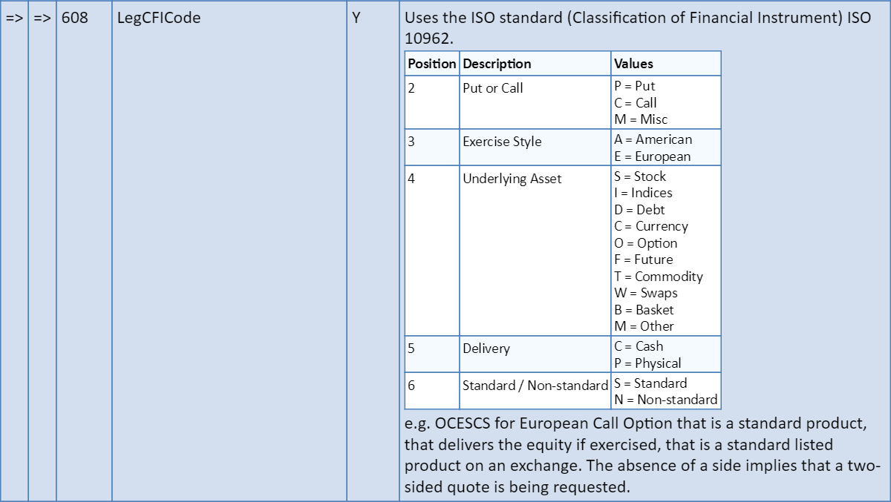

# Fun with documents

The idea behind this meetup is to be able to compose documents, and render them in a particular format.

In my opinion, document generation libraries are too often tied to a particular output format (such as PDF) and tend to be more focused on generating documents for which you know the shape in advance, and in which you want to inject a few items in placeholders.

We're going to see how defining a simple document DSL can help us to compose a document as a flow of document parts, and we'll see how we can handle the rendering of such documents.

Here is a screenshot of a sample from a document generated using such a DSL:

If we're successful, we could end up with the first step towards a new library :)